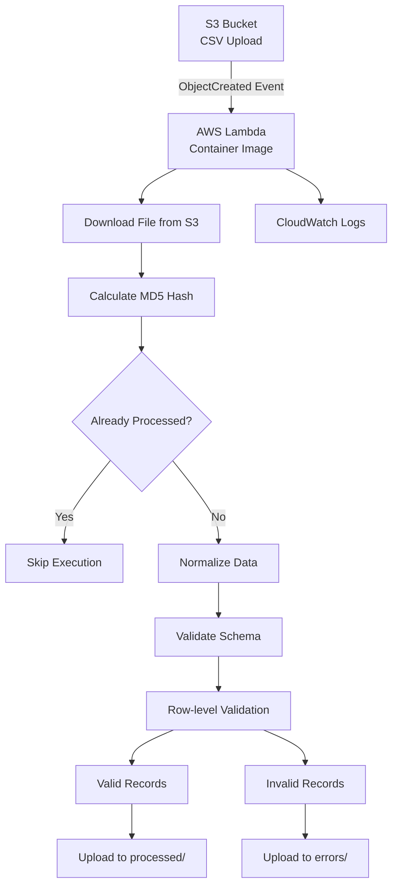

# Containerized Serverless Data Ingestion Pipeline

A production-style, event-driven data ingestion pipeline built on AWS using containerized Lambda.

The system performs schema validation, row-level validation, normalization, and content-based idempotency using MD5 hashing.

---

## 🏗️ Cloud Architecture

This solution follows a fully serverless, event-driven architecture.



---

## 🔁 Event Flow

1. A CSV file is uploaded to Amazon S3.  
2. An `ObjectCreated` event triggers AWS Lambda.  
3. The Lambda container downloads the file.  
4. An MD5 hash is computed for idempotency.  
5. If already processed → execution stops.  
6. If new → data is normalized and validated.  
7. Valid and invalid records are separated.  
8. Results are uploaded back to S3.  

---

## 🐳 Container-Based Deployment

Because of dependency size (Pandas + scientific stack), the function is deployed as a container image instead of a ZIP package.

The image lifecycle:

- Built locally with Docker  
- Pushed to Amazon ECR  
- Referenced by AWS Lambda as runtime image  

---

## 🛠 Tech Stack

- Python 3.10+
- AWS Lambda (Container Image)
- Amazon S3
- Amazon ECR
- Amazon CloudWatch
- Pandas
- Boto3
- Docker

---

## 📂 Project Structure

```
serverless-data-ingestion-pipeline/
│
├── src/
│   ├── lambda_handler.py
│   ├── storage.py
│   ├── cleaning.py
│   ├── validation.py
│   └── utils.py
│
├── tests/
│
├── Dockerfile
├── requirements.txt
├── README.md
└── .gitignore
```

---

## 🔐 Idempotency Strategy

Each file is hashed using MD5 before processing.

The hash is used as part of the output key.  
If an object with the same hash already exists in S3, the pipeline skips execution.

This guarantees:

- No duplicate processing  
- Safe retries  
- Deterministic outputs  

---

## 🧠 Design Principles

- Separation of concerns (clean module boundaries)  
- Fail-fast schema validation  
- Stateless Lambda execution  
- In-memory processing (no disk writes)  
- Content-based deduplication  
- Containerized serverless deployment  

---

## 🐳 Build and Push to Amazon ECR

### 1️⃣ Authenticate Docker

```bash
aws ecr get-login-password --region <region> \
| docker login \
--username AWS \
--password-stdin <account-id>.dkr.ecr.<region>.amazonaws.com
```

### 2️⃣ Build Image

```bash
docker build -t data-ingestion-lambda .
```

### 3️⃣ Tag Image

```bash
docker tag data-ingestion-lambda:latest \
<account-id>.dkr.ecr.<region>.amazonaws.com/data-ingestion-lambda:latest
```

### 4️⃣ Push Image

```bash
docker push <account-id>.dkr.ecr.<region>.amazonaws.com/data-ingestion-lambda:latest
```

### 5️⃣ Update Lambda

Update the Lambda function configuration to reference the new image version.

---

## 🔔 S3 Trigger Configuration

- Trigger Type: S3 Event Notification  
- Event: ObjectCreated (Put)  
- Filter: `*.csv`  

This enables fully automated ingestion without manual execution.

---
